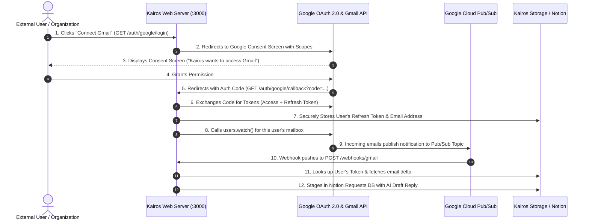

# 📊 Kairos — Project Progress & Gmail Multi-User Collaboration Guide

> **Document Purpose**: This guide is written for collaborating developers taking over or extending the Kairos Engine. It provides a complete status report of what is currently built and working, followed by the exact architectural roadmap and requirements to complete the **Official Gmail Multi-User Onboarding & Pub/Sub Integration**.

---

## 🧭 Part 1: Current Project Status & What is Built

Kairos is an autonomous, event-driven operations engine where **Notion serves as the human control interface** and **Node.js/Express serves as the background execution engine**.

### 🏆 Completed Features & Working Modules

| Component | Status | Implementation Details |
|---|---|---|
| **Notion 4-Database Architecture** | ✅ Live & Working | `Run Log`, `Invoices`, `Tasks`, and `Requests / Reminders` databases created and linked. Fully typed properties with CRUD operations in [`src/services/notionService.js`](file:///d:/Kairos/src/services/notionService.js). |
| **Authentic Code-Written Run Log** | ✅ Live & Working | Every single trigger, approval, rejection, and error logs an immutable row with live ISO timestamp to the Notion `Run Log` database. |
| **Local OpenWA WhatsApp Gateway** | ✅ Live & Working | Paired with WhatsApp via Puppeteer + system Chrome (`whatsapp-web.js`). Supports Direct Contacts (`@c.us`), Groups (`@g.us`), and Linked Devices / LIDs (`@lid`). |
| **OpenRouter AI Layer** | ✅ Live & Working | Multi-key auto-failover (`OPENROUTER_API_KEY` 1-4) with defensive JSON parsing, prompt engineering for English + Hinglish, and zero-crash heuristic fallback engine in [`src/services/aiService.js`](file:///d:/Kairos/src/services/aiService.js). |
| **Flow A (Invoices)** | ✅ Live & Working | Upload invoice into Notion Invoices DB $\rightarrow$ Status becomes `Awaiting Approval` $\rightarrow$ Human marks `Approved` in Notion $\rightarrow$ PDF dispatched to recipient via WhatsApp $\rightarrow$ Status updated to `Sent` + Run Log recorded. |
| **Flow B (Meeting Transcripts)** | ✅ Live & Working | Transcript sent to `POST /webhooks/transcript` $\rightarrow$ AI extracts tasks, owners, and due dates $\rightarrow$ Staged in Tasks DB with `Pending Review` + Run Log recorded. |
| **Flow C (Requests & Reminders)** | ✅ Live & Working | Inbound Email / WhatsApp message $\rightarrow$ AI classifies (Meeting, Support, Billing, etc.) and drafts response $\rightarrow$ Staged in Requests DB (`Awaiting Approval`) $\rightarrow$ Human marks `Approved` $\rightarrow$ Real-world reply dispatched $\rightarrow$ Run Log recorded. |
| **Central Durable Storage & Idempotency** | ✅ Live & Working | JSON-backed store in `data/kairos-store.json` caching processed `messageId` and `historyId` to guarantee zero duplicate executions. |
| **1-Command Deployer** | ✅ Live & Working | [`setup.sh`](file:///d:/Kairos/setup.sh) (Linux/macOS/Bash) and [`setup.ps1`](file:///d:/Kairos/setup.ps1) (PowerShell) for automated environment setup. |

---

## ✉️ Part 2: The Gmail Integration — Current State vs. Next Goal

### 📍 Current State
Currently, Gmail integration in [`src/services/gmailService.js`](file:///d:/Kairos/src/services/gmailService.js) is configured for a **single admin account** using pre-generated Google OAuth2 credentials (`GMAIL_CLIENT_ID`, `GMAIL_CLIENT_SECRET`, and a single hardcoded `GMAIL_REFRESH_TOKEN` in `.env`). It handles:
- Google Cloud Pub/Sub topic subscription (`projects/kairos-automation-506115/topics/gmail-notifications`).
- `users.watch()` registration and automatic 5-day renewal loop.
- Incoming push notifications via `POST /webhooks/gmail`.
- `history.list()` incremental delta fetching.
- Outbound `gmail.users.messages.send()`.

---

### 🎯 The Next Objective: "Official Multi-User Public Gmail OAuth Onboarding"

We need to evolve the Gmail integration so **any external user or organization can visit Kairos, click "Sign in with Google", grant permission for Kairos to read/send emails on their behalf, and automatically have their inbox connected to the Notion operations hub**.



---

## 🛠️ Step-by-Step Implementation Roadmap for the Gmail Developer

### Task 1: Build the OAuth2 Web Onboarding Flow

Create a dedicated authentication route file: `src/routes/auth.js` mounted at `/auth/google`.

#### Endpoints to Implement:

1. **`GET /auth/google/login`**:
   - Generates the Google OAuth2 consent URL with offline access to ensure a `refresh_token` is returned:
     ```javascript
     const authUrl = oauth2Client.generateAuthUrl({
       access_type: 'offline',
       prompt: 'consent', // Forces refresh_token generation on every sign-up
       scope: [
         'https://www.googleapis.com/auth/gmail.readonly',
         'https://www.googleapis.com/auth/gmail.send',
         'https://www.googleapis.com/auth/gmail.modify',
         'https://www.googleapis.com/auth/userinfo.email',
         'https://www.googleapis.com/auth/userinfo.profile'
       ]
     });
     res.redirect(authUrl);
     ```

2. **`GET /auth/google/callback`**:
   - Handles the OAuth redirect: receives `req.query.code`.
   - Exchanges the code for tokens:
     ```javascript
     const { tokens } = await oauth2Client.getToken(req.query.code);
     oauth2Client.setCredentials(tokens);
     ```
   - Fetches the authenticated user's email address using the `oauth2` API (`oauth2.userinfo.get()`).
   - Saves the user's `email`, `refreshToken`, and initial `historyId` into `src/services/storageService.js` (or database).
   - Immediately invokes `gmail.users.watch()` on behalf of this user to start streaming their inbound emails.
   - Redirects the user to a success page or back to their Notion workspace with a success confirmation.

---

### Task 2: Multi-User Mailbox State & Watch Management

Update [`src/services/storageService.js`](file:///d:/Kairos/src/services/storageService.js) to store multiple connected Gmail accounts:

```json
{
  "connected_accounts": {
    "user1@company.com": {
      "refreshToken": "1//04...",
      "lastHistoryId": "1876791",
      "watchExpiration": "1787856545813",
      "connectedAt": "2026-08-21T00:00:00.000Z"
    },
    "user2@startup.io": {
      "refreshToken": "1//09...",
      "lastHistoryId": "982341",
      "watchExpiration": "1787856999999",
      "connectedAt": "2026-08-21T01:00:00.000Z"
    }
  }
}
```

---

### Task 3: Update Pub/Sub Webhook Dispatcher for Multi-Tenancy

In [`src/routes/webhooks.js`](file:///d:/Kairos/src/routes/webhooks.js), Google Cloud Pub/Sub sends notifications containing the specific user's email:

```javascript
// Payload format from Google Pub/Sub:
// { "emailAddress": "user@company.com", "historyId": "1234567" }
const { emailAddress, historyId } = JSON.parse(Buffer.from(req.body.message.data, 'base64').toString('utf-8'));

// 1. Retrieve the refresh token for this specific emailAddress from storage
const userAccount = storageService.getAccountByEmail(emailAddress);

// 2. Instantiate OAuth2 client specifically for this user
const userGmailClient = gmailService.getGmailClientForUser(userAccount.refreshToken);

// 3. Fetch history delta and process incoming emails
await gmailService.processUserHistoryUpdate(userGmailClient, emailAddress, historyId);
```

---

### Task 4: Google Cloud Console Setup & Production Verification

To make this officially available to external users without "Untrusted App" warnings:

1. **Google Cloud Console (`kairos-automation-506115`)**:
   - Go to **APIs & Services** $\rightarrow$ **OAuth Consent Screen**.
   - Set User Type to **External**.
   - Add App Name: **Kairos Autonomous Operations Hub**.
   - Add User Support Email and Developer Contact Info.
   - Add Scopes:
     - `.../auth/gmail.readonly`
     - `.../auth/gmail.send`
     - `.../auth/gmail.modify`
     - `.../auth/userinfo.email`
2. **Authorized Redirect URIs**:
   - For Local Dev: `http://localhost:3000/auth/google/callback`
   - For Production: `https://your-domain.com/auth/google/callback`
3. **Publishing Status**:
   - While in *Testing Mode*, add specific test Google accounts under **Test Users**.
   - For public general availability, submit the app for Google OAuth Verification (requires a simple privacy policy page and demo video).

---

## 🧪 How to Verify Multi-User Gmail Flow

1. Open `http://localhost:3000/auth/google/login` in your browser.
2. Sign in with any test Google account.
3. Accept the requested permissions on Google's consent screen.
4. Verify you are redirected to the callback with success confirmation.
5. Check `data/kairos-store.json` — the new account and refresh token should be registered.
6. Send an email to that connected Gmail account $\rightarrow$ verify it triggers Pub/Sub $\rightarrow$ verify it gets structured by AI and staged in Notion `Requests / Reminders` DB.
7. Approve the item in Notion $\rightarrow$ verify an authentic reply is sent from that connected Gmail account.
