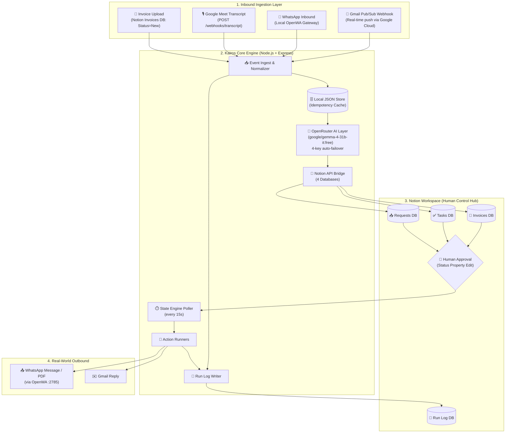

# ⏳ Kairos — Autonomous Operations Engine (Notion Track)

> **"Your code is the engine. Notion is the interface."**
> Kairos is an autonomous, event-driven operations engine. It ingests communications across Gmail, WhatsApp, and meeting transcripts — structures them with AI — stages human approvals inside Notion — and executes real-world actions with an immutable, code-written audit trail.

---

## 🎯 Core Philosophy

1. **Runs Without You** — Triggered by webhooks and background pollers. No manual intervention required.
2. **Humans Approve Inside Notion** — Critical actions (sending invoices, dispatching replies) pause at a human-facing Notion status gate before execution.
3. **Immutable Run Log** — Every execution, approval, rejection, and failure writes an authentic timestamped row to the Notion `Run Log` database via the API.
4. **Zero Crashes** — Dirty input, malformed AI output, and bad webhooks are caught, logged as `ignored` or `failed`, and never crash the engine.

---

## 🏗️ System Architecture



---

## ⚡ The Three Automated Flows

| Flow | Trigger | AI Role | Human Gate | Real-World Action |
|---|---|---|---|---|
| **A — Invoices** | Invoice uploaded to Notion (`Status: New`) | Validates metadata, flags missing phone | `Awaiting Approval` → `Approved` | Sends invoice PDF/text via **WhatsApp** |
| **B — Transcripts** | `POST /webhooks/transcript` with meeting text | Extracts tasks, owners, due dates | `Pending Review` → `Active` | Tasks live in Tasks DB for tracking |
| **C — Reminders** | Gmail Pub/Sub push or WhatsApp message | Categorizes, drafts reply, detects noise | `Awaiting Approval` → `Approved` | Sends reply via **Gmail** or **WhatsApp** |

---

## 📂 Project Structure

```
Kairos/
├── src/
│   ├── server.js                 # Express server entry point
│   ├── routes/
│   │   └── webhooks.js           # All webhook endpoints
│   └── services/
│       ├── aiService.js          # OpenRouter multi-key AI engine (English + Hinglish)
│       ├── gmailService.js       # Gmail OAuth2 + Pub/Sub
│       ├── notionService.js      # 4-database Notion layer + Run Log
│       ├── pipelineService.js    # Flow A, B, C orchestration
│       ├── storageService.js     # Local JSON store + idempotency
│       └── whatsappService.js    # OpenWA gateway client (Direct, Groups & LIDs)
│
├── tests/
│   ├── test-pipeline.js          # Full 5-step system validation
│   ├── test-flow-a.js            # Invoice → Approval → WhatsApp
│   ├── test-notion.js            # Notion connectivity check
│   ├── test-webhooks.js          # Live endpoint simulation
│   └── test-gmail-all.js         # Comprehensive Gmail suite (watch, send, push)
│
├── scripts/
│   ├── init-notion-databases.js  # Create all 4 Notion databases
│   └── sync-gmail.js             # Manually sync latest Gmail emails into Notion
│
├── docs/
│   ├── project-guide.md          # Full hackathon project blueprint
│   ├── notion_track.md           # Notion Track judging criteria
│   ├── gmail-webhook-setup.md    # Gmail Pub/Sub setup guide
│   └── architecture.png          # Hand-drawn architecture diagram
│
├── openwa/                       # Local WhatsApp gateway (submodule)
├── setup.sh                      # 1-command automated setup for Linux / macOS / Git Bash
├── setup.ps1                     # 1-command automated setup for Windows PowerShell
├── .env                          # Live credentials (gitignored)
├── .env.example                  # Safe credentials template
├── STRUCTURE.md                  # Full project map & milestones
└── package.json
```

---

## 🗄️ Notion Database Schema

### 📗 Run Log (Audit Trail)
| Property | Type | Values |
|---|---|---|
| Summary | Title | Human-readable description of the run |
| Timestamp | Date | ISO timestamp written by code |
| Flow | Select | `invoice`, `meeting_transcript`, `reminders` |
| Trigger Type | Select | `webhook`, `cron`, `notion_poll` |
| Status | Select | `success`, `failed`, `pending_approval`, `rejected`, `ignored` |
| Related Item | Rich Text | ID/reference of the affected record |
| Error | Rich Text | Error message if status is `failed` |

### 📄 Invoices
| Property | Type | Values |
|---|---|---|
| Invoice Name | Title | — |
| Recipient Name | Rich Text | — |
| Phone Number | Phone | WhatsApp-compatible (e.g. `+919876543210`) |
| Amount | Number | — |
| Due Date | Date | — |
| File | Files & Media | PDF attachment |
| Status | Select | `New` → `Awaiting Approval` → `Approved` → `Sent` / `Send Failed` / `Needs Info` |

### ✅ Tasks
| Property | Type | Values |
|---|---|---|
| Task | Title | Extracted task title |
| Source Meeting | Rich Text | Origin transcript |
| Owner | Rich Text | Assigned person |
| Due Date | Date | AI-extracted deadline |
| AI Reasoning | Rich Text | Why this task was extracted |
| Status | Select | `Pending Review`, `Active`, `Done`, `Rejected` |

### 📥 Requests / Reminders
| Property | Type | Values |
|---|---|---|
| Item | Title | Message headline |
| Source | Select | `email`, `whatsapp` |
| Sender | Rich Text | Email or phone |
| Category | Select | `Support`, `Billing`, `Meeting`, `General`, `Urgent` |
| Priority | Select | `Low`, `Medium`, `High` |
| Summary | Rich Text | AI-cleaned summary |
| Status | Select | `Awaiting Approval`, `Approved`, `Rejected`, `Ignored` |

---

## 🛡️ Fault Tolerance

| Threat | How Kairos Handles It |
|---|---|
| Non-JSON / garbage AI output | Defensive parser strips markdown fences; falls back to heuristic engine; logs as `Needs Manual Review` |
| Duplicate webhook delivery | Idempotency cache in `data/kairos-store.json` deduplicates by `messageId` / `historyId` |
| Missing phone on invoice | Flagged as `Needs Info` in Notion — never crashes dispatcher |
| All 4 OpenRouter keys rate-limited | Falls back to built-in heuristic NLP engine, zero downtime |
| Gmail `historyId` expiry | Auto re-registers `users.watch()` and resets history baseline |
| WhatsApp session drop | Logs to Run Log; session is encrypted and persisted on disk |

---

## 🚀 1-Command Automated Setup & Run

On any PC (Linux, macOS, or Windows), clone the repo and run one command to install all dependencies, patch OpenWA, configure databases, and start everything:

### On Linux / macOS / Git Bash:
```bash
chmod +x setup.sh
./setup.sh
```

### On Windows PowerShell:
```powershell
.\setup.ps1
```

---

## 🛠️ Manual Step-by-Step Setup (Alternative)

### 1. Clone & Install
```bash
git clone https://github.com/LovekeshAnand/Kairos.git
cd Kairos
npm install
```

### 2. Configure `.env`
Copy `.env.example` to `.env` and fill in your credentials:
```env
PORT=3000

# Notion
NOTION_API_KEY=ntn_your_token
NOTION_PARENT_PAGE_ID=your_page_id
NOTION_RUN_LOG_DB_ID=your_db_id
NOTION_INVOICES_DB_ID=your_db_id
NOTION_TASKS_DB_ID=your_db_id
NOTION_REQUESTS_DB_ID=your_db_id

# OpenRouter AI (get free keys at openrouter.ai)
OPENROUTER_API_KEY=sk-or-v1-...
OPENROUTER_MODEL=google/gemma-4-31b-it:free

# Gmail OAuth2
GMAIL_CLIENT_ID=...
GMAIL_CLIENT_SECRET=...
GMAIL_REFRESH_TOKEN=...
GMAIL_PUB_SUB_TOPIC=projects/your-project/topics/gmail-notifications

# OpenWA Local Gateway
OPENWA_API_URL=http://localhost:2785
OPENWA_API_KEY=owa_k1_...
OPENWA_SESSION_ID=your_session_id
```

### 3. Initialize Notion Databases
```bash
npm run setup:notion
```

### 4. Start OpenWA Gateway (separate terminal)
```bash
cd openwa
npm run start:dev
# Scan the QR code in the dashboard at http://localhost:2886
```

### 5. Start Kairos Engine
```bash
npm run dev        # development with auto-reload
npm start          # production
```

---

## 🧪 Running Tests

```bash
npm run test:all        # Full 5-step system validation (Notion, AI, Flows B & C)
npm run test:notion     # Notion connectivity + Run Log write
npm run test:flow-a     # Flow A: Invoice → Approval → WhatsApp
npm run test:webhooks   # Simulate all 3 flows via HTTP (server must be running)
npm run test:gmail      # Comprehensive Gmail suite (watch, send, push simulation)
npm run sync:gmail      # Manually sync latest 5 Gmail inbox messages to Notion
```

---

## 🔗 Webhook Endpoints

| Method | Endpoint | Purpose |
|---|---|---|
| `GET` | `/health` | Engine status + integration health checks |
| `POST` | `/webhooks/gmail` | Google Cloud Pub/Sub push listener |
| `POST` | `/webhooks/whatsapp` | OpenWA inbound event listener |
| `POST` | `/webhooks/transcript` | Google Meet transcript ingestion |
| `POST` | `/webhooks/simulate` | Multi-flow event simulator for demos |
| `POST` | `/webhooks/poll` | Manually trigger Notion approval state check |
