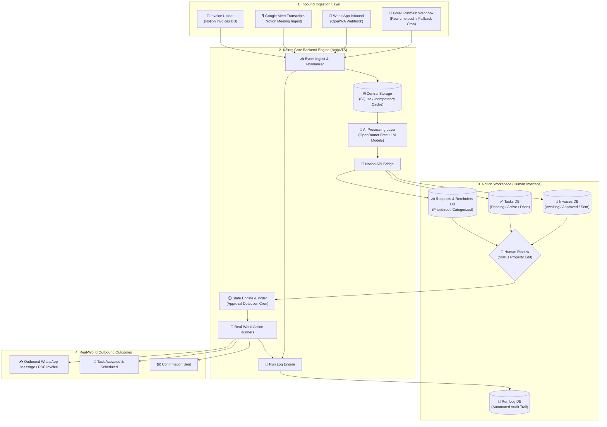

# ⏳ Kairos — Autonomous Agency Engine (Notion Track)

> **"Your code is the engine. Notion is the interface."**
> Kairos is an autonomous, event-driven operations engine designed for colleges, clubs, shops, and agencies. It ingests messy communications across email, WhatsApp, and meeting transcripts, normalizes and extracts actionable data with AI, stages human approvals inside Notion, and executes real-world actions with an immutable, code-written audit log.

---

## 🎯 The Core Philosophy

1. **Runs Without You**: Deployed on a server, triggered by webhooks and crons. Never manually run for demos.
2. **Humans Approve Inside Notion**: Critical real-world actions (sending invoices, dispatching messages, activating tasks) pause for human sign-off via Notion status properties.
3. **Immutable Proof (Run Log)**: Every execution, approval, rejection, and handled failure writes an authentic row to the Notion `Run Log` via the API with a real timestamp.
4. **Resilient to Chaos**: Dirty input, non-JSON AI output, or malformed webhooks never crash the system—they get flagged for manual review and logged transparently.

---

## 🏗️ System Architecture



---

## 🔄 End-to-End Workflow & The Three Flows

### 📊 Flow Matrix

| Flow | Trigger | AI Responsibility | Notion Staging | Human Action | Real-World Execution |
|---|---|---|---|---|---|
| **Flow A: Invoices** | Invoice PDF uploaded to Notion Invoices DB | Validates metadata & recipient details | Status set to `Awaiting Approval` | Changes Status to `Approved` | Sends invoice PDF via WhatsApp to recipient number |
| **Flow B: Transcripts** | Google Meet transcript lands in Notion | Extracts tasks, assignees, deadlines, and reasoning | Generates task entries in Tasks DB (`Pending Review`) | Reviews/edits and marks `Active` | Finalizes task schedule & logs confirmation |
| **Flow C: Reminders & Requests** | Incoming email or WhatsApp message | Filters noise/spam, parses category, priority, and summary | Writes to Requests DB (`Awaiting Approval`) | Approves action or overrides priority | Sends WhatsApp/Email confirmation to sender |

---

## 📂 Detailed Directory & Architecture Map

```
Kairos/
├── docs/                        # Architecture & Track Guides
│   ├── architecture.png         # Visual system architecture
│   ├── gmail-webhook-setup.md   # Step-by-step Gmail Pub/Sub guide
│   ├── notion_track.md          # Notion Track hackathon brief & judging rules
│   └── project-guide.md         # Comprehensive project build guide
├── src/
│   ├── config/                  # Environment variables & zod validator
│   ├── db/                      # SQLite central storage & migrations
│   ├── flows/                   # Flow A, Flow B, Flow C implementations
│   ├── prompts/                 # LLM prompts for email, whatsapp, and transcripts
│   ├── routes/                  # Express webhook routes (Gmail, WhatsApp, Health)
│   ├── scheduler/               # Crons (approval polling, watch renewal)
│   ├── services/                # Notion client, Run Logger, OpenRouter AI, OpenWA
│   └── server.ts                # Express server entry point
├── package.json
├── tsconfig.json
└── README.md
```

---

## 🗄️ Notion Database Schema Specifications

The Notion workspace consists of 4 core databases:

### 1. `Run Log` Database (Audit Trail)
* **Summary** (`Title`): Short human-readable summary of the run
* **Timestamp** (`Date` with time): When code executed the action
* **Flow** (`Select`): `invoice`, `meeting_transcript`, `reminders`
* **Trigger Type** (`Select`): `webhook`, `cron`, `notion_poll`
* **Status** (`Select`): `success`, `failed`, `pending_approval`, `rejected`, `ignored`
* **Related Item** (`Rich Text`): ID or link of affected entity
* **Error** (`Rich Text`): Error message or stack trace if failed

### 2. `Invoices` Database
* **Invoice Name** (`Title`): Client or Invoice identifier
* **File** (`Files & Media`): Uploaded invoice PDF
* **Recipient Name** (`Rich Text`): Client name
* **Phone Number** (`Phone`): WhatsApp recipient number (e.g. `+919876543210`)
* **Amount** (`Number`): Invoice total
* **Due Date** (`Date`): Payment deadline
* **Status** (`Select`): `New`, `Awaiting Approval`, `Approved`, `Rejected`, `Sent`, `Send Failed`, `Needs Info`

### 3. `Tasks` Database
* **Task** (`Title`): Extracted task title
* **Source Meeting** (`Rich Text` / `Relation`): Source transcript title
* **Owner** (`Rich Text`): Assignee
* **Due Date** (`Date`): Extracted deadline
* **Status** (`Select`): `Pending Review`, `Active`, `Done`, `Rejected`
* **AI Reasoning** (`Rich Text`): Why the AI extracted this task

### 4. `Requests / Reminders` Database
* **Item** (`Title`): Summary headline of inbound message
* **Source** (`Select`): `email`, `whatsapp`
* **Sender** (`Rich Text`): Sender email or phone number
* **Category** (`Select`): Support, Billing, Meeting, General
* **Priority** (`Select`): `Low`, `Medium`, `High`
* **Status** (`Select`): `Awaiting Approval`, `Approved`, `Rejected`, `Ignored`, `Needs Manual Review`
* **Summary** (`Rich Text`): Cleaned message summary

---

## 🛡️ Hardening & Fault Tolerance

| Threat / Bad Input | System Handling |
|---|---|
| **Garbage / Non-JSON AI Response** | Captured safely, stripped of markdown fences; if invalid JSON, flagged as `Needs Manual Review` with raw content preserved. |
| **Duplicate Webhook Delivery** | Central SQLite idempotency table caches `messageId`/`historyId` and drops repeats with an `ignored` Run Log entry. |
| **Missing Phone / Malformed Field** | Invoice flagged as `Needs Info` rather than crashing; Run Log records a descriptive error. |
| **Notion API Downtime** | Exponential backoff retry with offline queuing. |
| **WhatsApp Disconnect** | Detects state change, logs to Run Log, and prompts reconnection without dropping pending items. |

---

## 🚀 Setup & Execution Quickstart

### 1. Install Dependencies
```bash
npm install
```

### 2. Configure Environment (`.env`)
Create a `.env` file from `.env.example`:
```env
PORT=3000
NOTION_API_KEY=ntn_your_notion_token
NOTION_RUN_LOG_DB_ID=your_db_id
NOTION_INVOICES_DB_ID=your_db_id
NOTION_TASKS_DB_ID=your_db_id
NOTION_REQUESTS_DB_ID=your_db_id

OPENROUTER_API_KEY=your_openrouter_key
```

### 3. Start the Engine
```bash
# Development mode with hot-reload
npm run dev

# Production build
npm run build
npm start
```
