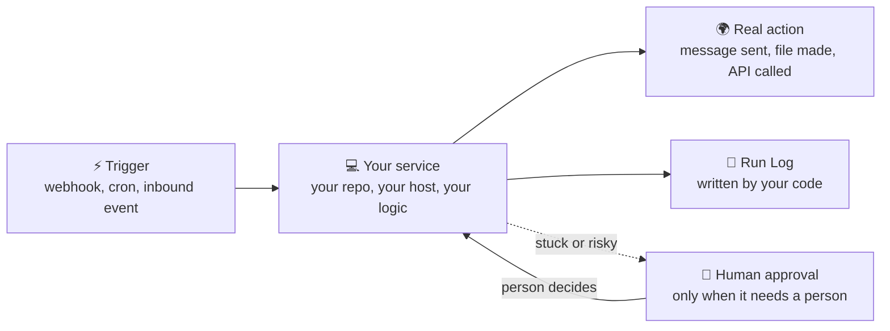

# Theme — Notion Track

## 1. The Problem

Every college, club, shop, and small agency in India has three or four jobs a person redoes by hand every week:

- Attendance registers
- Requests dying in a WhatsApp group
- Form responses copied into a sheet
- A follow-up nobody sent
- A PDF forwarded to seven people so one of them can retype it

None of it is hard to automate. It just never got built, because the people doing the job cannot code and the people who can code never see the job.

Off-the-shelf tools do not fit, because the job is specific to that college, that shop, that team.

You are not fixing India in a week. You are killing **one of those jobs properly** and leaving behind a running service plus a workspace the humans can operate after you are gone.

---

## 2. What You Are Building

Build a service that automates **one real job**, with **Notion as its interface**.

Think of it like this:

> Your code is the engine. Notion is the interface. A trigger fires, your code does the work, a real action happens in the outside world, and a row lands in the Run Log. The human never runs anything. They read what happened, approve what matters, and override what is wrong.

### The Three Things Your System Must Do

#### 1. It runs without you

A webhook, a cron, or an inbound event fires it, on something you deployed.

Running a script by hand during your demo is **not** a running service.

#### 2. Humans approve the decisions that matter, inside Notion

At least one point in your workflow pauses and waits for a person to approve, reject, or override before the action fires.

#### 3. It leaves proof

Every run writes a row to the **Run Log** with a real timestamp, written by your code.

Rows spread across the event, not sixty rows created the night before demo day.

### What You Are NOT Building

- A Zapier chain with a Notion page sitting on top of it. If the interesting part of your system lives inside a no-code canvas, you are in the wrong track.
- A chatbot. Chat is a doorway, not a system.
- A dashboard full of charts with no engine behind it.
- A React app that treats Notion as a database and gives the human nothing. A person has to be able to do their whole part of the job inside Notion.
- Five shallow features. **One job killed cleanly beats five half-wired ideas.**

> 🔪 **The test that kills the shortcut:** delete your repo. Does the system still work?
>
> If yes, you did not build anything. You wired up a no-code tool and put a Notion page on top. That does not score.

---

## 3. How the System Flows

Any stack, any framework. The shape below is the reference, not a requirement.

### Three Ideas to Internalize

#### The engine is your code

The logic that decides what happens lives in a repo you can show us.

Your code talks to Notion through the API or the MCP server, with your own integration token.

#### Notion is the interface, not the middleware

It is where the data lives, where humans approve, and where every run gets logged.

**Do not route every step through it.**

#### The action happens outside Notion

A message sent, a file made, an API called.

If nothing changes in the real world, you built a dashboard.

---

## 4. Where AI Actually Earns Its Place

AI handles what rules cannot:

- Reading messy input
- Sorting it
- Drafting the action

Your code is the one calling it.

An AI property inside a Notion database is **not an engine**.

### AI Earns It

- A form arrives as one messy paragraph. AI reads it, pulls out the fields, sets a priority, and routes it to the right owner.
- Incoming requests in three languages get understood and categorised without a lookup table.
- The system drafts the reply, a human approves it in Notion, then it sends.

### AI Does Not Earn It

- AI writes a summary nobody reads.
- A chatbot answers questions about a database you could have just looked at.
- AI generates text to fill a page so the workspace looks busy.

> **Rule of thumb:** if an `if` statement could have done it, an `if` statement should have done it.

---

## 5. Notion's Role

> ⭐ **Notion is the database, the control panel, and the audit trail.**
>
> Your service can run anywhere and use any stack. But everything a human needs to see, approve, or override lives in Notion.
>
> A person who has never seen your code should be able to open the workspace and know:
>
> - What the system does
> - What it did today
> - What is pending
> - What needs their attention

### The Test Judges Will Apply

**Turn your service off. Is the Notion workspace still a useful place to run this job?**

If your workspace is a dump of JSON-looking rows nobody would read, the answer is **no**.

If it is a clean, human-readable operations hub that your code happens to maintain, the answer is **yes**.

Build for **yes**.

### Common Notion Mistakes

Avoid:

- Writing raw model output into pages. Format for humans: clear titles, statuses, short reasoning summaries.
- Faking the Run Log by hand. Rows written by your integration are attributed differently from rows you type. Judges check.
- Building the Notion layer in the last two hours. It is a judging pillar. Design it on day one.

---

## 6. End Goals

By the end of the event, your project should achieve:

### One Job, Fully Automated

A trigger fires, your code does the work, a real action happens outside Notion, and a row lands in the Run Log.

**No human in the middle.**

### A Workspace a Stranger Can Run the Job From

Someone who has never seen your code opens Notion and knows:

- What happened
- What is pending
- What needs them

### A System That Survives Bad Input

Garbage in should result in:

- No crash
- No duplicates
- Nothing silently lost

Anything it cannot handle goes to a human instead of disappearing.

### Proof You Built It Across the Event

Commits and Run Log rows should be spread over the days, not created in one night.

### A Durable Design

Ask yourselves:

> **Who notices when the system makes a bad call?**

If the answer is:

> "The person reading the Notion workspace."

Then you built the right thing.

---

## 7. Your Stack and Your Setup

Any stack.

- Python
- TypeScript
- Go
- Or whatever you already write in

You are scored on **what your system does and how well it is built**, not what it is written in.

### Free to Build

Everything runs on:

- Notion's free plan
- Free hosting tiers

Students get free **Notion Education Plus** at [notion.com/students](https://www.notion.com/students), set up during the opening session.

> **Come with a boring job in mind.**
>
> The best ones come from your own week.
